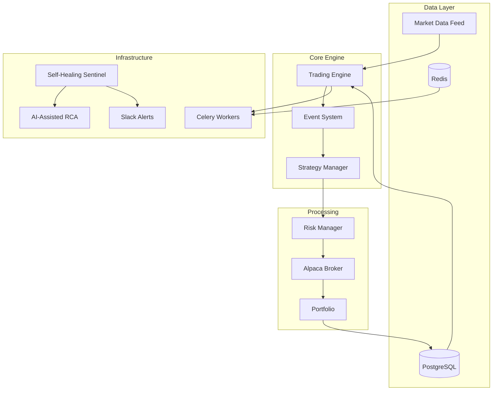

# 🧠 Krator - Self-Healing Algorithmic Trading System

[](https://opensource.org/licenses/MIT)
[](https://www.python.org/downloads/)
[](https://www.docker.com/)
[](https://kubernetes.io/)

**Krator** is a real-time, self-healing algorithmic trading system built with modern Python architecture. It features async streaming, AI-assisted root cause analysis, and production-ready deployment with Kubernetes.

## 🚀 Key Features

- **🔄 Self-Healing Architecture**: Automated fault detection and recovery with AI-assisted RCA
- **⚡ Real-time Processing**: Async event-driven architecture with microsecond-precision timing
- **📊 TA-Lib Integration**: 150+ technical indicators with NaN-safe wrappers
- **🎯 Risk Management**: Comprehensive portfolio risk controls and circuit breakers
- **📱 Slack Integration**: Real-time trading alerts and system notifications
- **🐳 Cloud-Native**: Docker and Kubernetes ready with auto-scaling
- **📈 Production-Ready**: Structured logging, monitoring, and observability

## 🏗️ Architecture Overview



## 📋 Prerequisites

### macOS Prerequisites

```bash
# Install Xcode command line tools
xcode-select --install

# Install Homebrew dependencies
brew update && brew install ta-lib postgresql redis
```

### System Requirements

- **Python**: 3.11 or higher
- **Memory**: Minimum 4GB RAM (8GB recommended)
- **Storage**: 10GB free space
- **Network**: Stable internet connection for market data

## 🛠️ Installation

### 1. Clone Repository

```bash
git clone https://github.com/AbsoluteZero000-afk/Krator.git
cd Krator
```

### 2. Create Virtual Environment

```bash
python3 -m venv .venv
source .venv/bin/activate  # On Windows: .venv\Scripts\activate
```

### 3. Install Dependencies

```bash
pip install --upgrade pip
pip install -r requirements.txt
```

### 4. Configure Environment

```bash
cp .env.example .env
# Edit .env with your configuration
```

**Required Configuration:**
- `ALPACA_API_KEY`: Your Alpaca trading API key
- `ALPACA_SECRET_KEY`: Your Alpaca secret key
- `SLACK_WEBHOOK_URL`: Slack webhook for notifications
- `DATABASE_URL`: PostgreSQL connection string
- `REDIS_URL`: Redis connection string

### 5. Start Dependencies

```bash
# Start PostgreSQL and Redis with Docker
docker compose -f docker/docker-compose.yml up -d
```

### 6. Initialize Database

```bash
python scripts/seed_db.py
```

### 7. Validate Installation

```bash
python scripts/quick_check.py
```

Expected output:
```
✅ TA-Lib installation verified
✅ Database connection successful
✅ Redis connection successful
✅ Environment variables loaded
✅ All systems ready
```

## 🚀 Quick Start

### Run Paper Trading

```bash
python scripts/live_trade.py --symbols AAPL,MSFT --timeframe 1Min --paper
```

### Run Backtest

```bash
python scripts/backtest.py \
    --symbols AAPL,MSFT \
    --start 2024-01-01 \
    --end 2024-12-31 \
    --strategy config/strategy.yaml
```

### Start Celery Worker

```bash
celery -A infra.celery_app:app worker -l INFO
```

### Test Slack Notifications

```bash
python -c "from infra.alerts import alert_heartbeat; alert_heartbeat('System test')"
```

## 🤖 AI-Assisted RCA (Optional)

Enable AI-powered root cause analysis for automated incident response:

### 1. Configure AI Provider

```bash
# In .env file
AI_ASSIST_ENABLED=true
AI_ASSIST_PROVIDER=openai  # or 'anthropic'
AI_ASSIST_API_KEY=your_api_key_here
AI_ASSIST_MODEL=gpt-4o-mini
```

### 2. Test RCA

```bash
# Simulate a system fault to test RCA
python -c "
from infra.sentinel import trigger_test_fault
trigger_test_fault('redis_connection')
"
```

The system will:
1. Detect the fault automatically
2. Generate an RCA summary using AI
3. Post a detailed Slack alert with recommended actions
4. If AI fails, fall back to baseline alerts

## 📊 System Monitoring

### Health Check Endpoint

```bash
curl http://localhost:8080/health
```

### Metrics Dashboard

Access Prometheus metrics at: `http://localhost:9090/metrics`

### Log Analysis

```bash
# View structured JSON logs
tail -f logs/krator.log | jq .

# Filter trading events
tail -f logs/krator.log | jq 'select(.event_type == "trade_execution")'

# Monitor risk events
tail -f logs/krator.log | jq 'select(.event_type == "risk_event")'
```

## 🐳 Docker Deployment

### Build Image

```bash
docker build -f docker/Dockerfile -t krator:latest .
```

### Run with Docker Compose

```bash
docker compose -f docker/docker-compose.yml up -d
```

## ☸️ Kubernetes Deployment

### Deploy to K8s

```bash
# Create namespace
kubectl create namespace krator

# Deploy PostgreSQL
kubectl apply -f k8s/postgres.yaml

# Deploy Redis
kubectl apply -f k8s/redis.yaml

# Deploy Krator
kubectl apply -f k8s/krator-deployment.yaml

# Deploy Celery workers
kubectl apply -f k8s/celery-worker.yaml
```

### Check Deployment

```bash
kubectl get pods -n krator
kubectl logs -f deployment/krator-engine -n krator
```

## 📈 Trading Strategies

Krator includes several built-in strategies:

### 1. SMA Crossover
```yaml
# config/strategy.yaml
strategy:
  name: "SMA_Crossover"
  params:
    fast_period: 12
    slow_period: 26
    risk_per_trade: 0.02
```

### 2. RSI Mean Reversion
```yaml
strategy:
  name: "RSI_MeanReversion"
  params:
    rsi_period: 14
    oversold: 30
    overbought: 70
    position_size: 100
```

### 3. Bollinger Bands Breakout
```yaml
strategy:
  name: "BB_Breakout"
  params:
    bb_period: 20
    bb_std: 2.0
    volume_threshold: 1.5
```

## 🛡️ Risk Management

Krator implements comprehensive risk controls:

- **Portfolio Risk**: Maximum 2% risk per trade
- **Daily Drawdown**: Maximum 5% daily loss limit
- **Position Limits**: Maximum positions per symbol
- **Circuit Breakers**: Automatic trading halt on anomalies
- **Correlation Limits**: Maximum sector exposure

## 📡 Event System

The core event system handles:

```python
from core.events import create_signal_event, OrderSide

# Generate trading signal
signal = create_signal_event(
    symbol="AAPL",
    signal_type="BUY",
    side=OrderSide.BUY,
    strength=0.8,
    strategy_name="RSI_Strategy"
)

# Publish to engine
await engine.publish_event(signal)
```

## 🧪 Testing

### Run Unit Tests

```bash
pytest tests/ -v
```

### Run Integration Tests

```bash
pytest tests/integration/ -v --cov=core
```

### Test Specific Components

```bash
# Test event system
pytest tests/test_events.py -v

# Test TA-Lib indicators
pytest tests/test_indicators.py -v

# Test engine
pytest tests/test_engine.py -v
```

## 🔧 Troubleshooting

### Common Issues

#### TA-Lib Installation Error

```bash
# macOS
brew install ta-lib
export TA_INCLUDE_PATH="$(brew --prefix ta-lib)/include"
export TA_LIBRARY_PATH="$(brew --prefix ta-lib)/lib"
pip install --upgrade numpy
pip install TA-Lib
```

#### Database Connection Error

```bash
# Check PostgreSQL status
docker ps | grep postgres

# Reset database
docker compose down
docker compose up -d postgres
python scripts/seed_db.py
```

#### Celery Worker Not Starting

```bash
# Check Redis connection
redis-cli ping

# Clear Celery queues
celery -A infra.celery_app purge
```

#### Slack Notifications Not Working

```bash
# Test webhook
curl -X POST -H 'Content-type: application/json' \
  --data '{"text":"Test message"}' \
  YOUR_SLACK_WEBHOOK_URL
```

### Performance Tuning

```bash
# Increase event queue size
export MAX_QUEUE_SIZE=50000

# Optimize database connections
export DATABASE_POOL_SIZE=50
export DATABASE_MAX_OVERFLOW=100

# Tune Celery workers
export CELERY_WORKER_PREFETCH_MULTIPLIER=1
export CELERY_WORKER_MAX_TASKS_PER_CHILD=1000
```

## 📚 Documentation

- [Architecture Guide](docs/architecture.md)
- [Strategy Development](docs/strategies.md)
- [Risk Management](docs/risk.md)
- [Deployment Guide](docs/deployment.md)
- [API Reference](docs/api.md)

## 🤝 Contributing

1. Fork the repository
2. Create a feature branch: `git checkout -b feature/amazing-feature`
3. Commit your changes: `git commit -m 'Add amazing feature'`
4. Push to the branch: `git push origin feature/amazing-feature`
5. Open a Pull Request

### Development Setup

```bash
# Install development dependencies
pip install -r requirements-dev.txt

# Install pre-commit hooks
pre-commit install

# Run code quality checks
black .
flake8 .
mypy .
```

## ⚖️ License

This project is licensed under the MIT License - see the [LICENSE](LICENSE) file for details.

## 🔗 Links

- **GitHub**: https://github.com/AbsoluteZero000-afk/Krator
- **Documentation**: https://krator.readthedocs.io
- **Issues**: https://github.com/AbsoluteZero000-afk/Krator/issues
- **Discussions**: https://github.com/AbsoluteZero000-afk/Krator/discussions

## ⚠️ Disclaimer

This software is for educational and research purposes only. Trading financial instruments involves substantial risk of loss and is not suitable for all investors. The authors and contributors are not responsible for any financial losses incurred through the use of this software.

Always test thoroughly with paper trading before using real money, and never risk more than you can afford to lose.

---

**Built with ❤️ for the quantitative trading community**